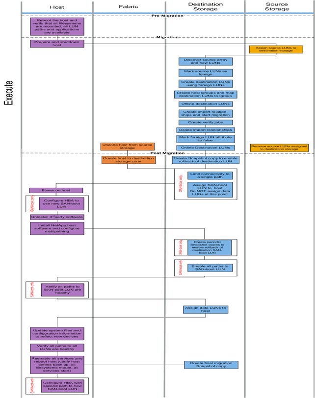

= Fluxo de trabalho de migração offline
:allow-uri-read: 
:icons: font
:imagesdir: ../media/

[role="lead"]
O fluxo de trabalho de migração offline é realizado na fase de execução do processo de migração. O diagrama de fluxo de trabalho off-line mostra as tarefas que são executadas no host, na malha, no armazenamento de destino e no armazenamento de origem.

As tarefas de fluxo de trabalho offline são listadas na tabela a seguir.

[cols="2*"]
|===
| Componente | Tarefas 

 a| 
Host
 a| 
. Reinicie o host e verifique se todos os sistemas de arquivos são montados, todos os caminhos LUN estão disponíveis e os serviços são iniciados.
. Prepare e desligue o host.
. Após a conclusão da migração, ligue o host.
. Configure o HBA para usar o novo LUN de inicialização SAN (somente inicialização SAN).
. Desinstale o MPIO de terceiros.
. Instale o software host NetApp e configure multipathing.
. Verifique se todos os caminhos para o LUN de inicialização SAN estão íntegros (somente inicialização SAN).
. Atualize os arquivos do sistema e a configuração para refletir novos dispositivos.
. Verifique se todos os caminhos para todos os LUNs estão íntegros.
. Reative todos os serviços e reinicie o host (verifique se o host vem de volta, todos os sistemas de arquivos são montados, todos os serviços são iniciados).
. Configure o HBA com o segundo caminho para o novo LUN de inicialização SAN (somente inicialização SAN).

 a| 
Malha
 a| 
. Deszona o host do armazenamento de origem.
. Criar host para zona de armazenamento de destino.

 a| 
Armazenamento de destino
 a| 
. Descubra o array de origem e novos LUNs.
. Marcar LUNs de origem como estranhos.
. Crie LUNs de destino usando LUNs externos.
. Crie grupos de iniciadores de host e mapeie LUNs de destino para a cópia Snapshot do igrop.migration.
. LUNs de destino offline.
. Crie relações de importação e inicie trabalhos de importação.
. Criar trabalhos de verificação (opcional).
. Eliminar relações de importação.
. Marque o atributo LUN estrangeiro como false.
. LUNs de destino online.
. Crie uma cópia Snapshot para ativar a reversão do LUN de destino.
. Limite a conetividade a um único caminho (somente inicialização SAN).
. Atribua LUN de inicialização SAN ao host; não atribua LUNs de dados neste momento (somente inicialização SAN).
. Verifique se todas as portas do host estão conetadas.
. Crie cópias Snapshot periódicas para permitir a reversão do LUN de inicialização SAN de destino (somente inicialização SAN).
. Habilite todos os caminhos para LUN de inicialização SAN (somente inicialização SAN).
. Atribuir LUNs de dados ao host.
. Criar uma cópia Snapshot final.

 a| 
Armazenamento de origem
 a| 
. Atribuir LUNs de origem ao armazenamento de destino.
. Remova os LUNs de origem atribuídos ao armazenamento de destino.

|===