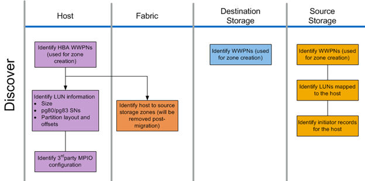

= Descubra o fluxo de trabalho de fase
:allow-uri-read: 
:icons: font
:imagesdir: ../media/

[role="lead"]
A fase de descoberta do processo de migração se concentra na coleta de informações usadas para correção do host e na criação de planos de migração nas etapas posteriores. A coleta da maioria das informações é automatizada usando uma ferramenta de coleta de dados, como o OneCollect.

A figura a seguir mostra o fluxo de trabalho da fase de descoberta.

As tarefas da fase de descoberta estão listadas na tabela a seguir.

[cols="2*"]
|===
| Componente | Tarefas 

 a| 
Host
 a| 
. Identificar WWPNs HBA (usado para criação de zona).
. Identificar informações de LUN (tamanho, números de série, layouts de partição e desvios).
. Identificar configuração MPIO de terceiros, sistema operacional host, modelos e firmware HBA/CNA, etc.

 a| 
Malha
 a| 
Identificar zonas de armazenamento de host para origem. (Estes são removidos após a migração).

 a| 
Armazenamento de destino
 a| 
Identifique os WWPNs para as portas que serão usadas para o uso do iniciador/destino.

 a| 
Armazenamento de origem
 a| 
. Identificar WWPNs (usado para criação de zona).
. Identificar LUNs mapeados para o host.
. Identificar Registros do iniciador para o host.

|===