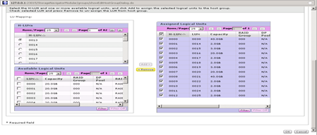

= Remoção de LUNs de origem do armazenamento ONTAP
:allow-uri-read: 
:icons: font
:imagesdir: ../media/

[role="lead"]
As etapas a seguir descrevem como remover LUNs de origem do armazenamento ONTAP após a conclusão da migração.

NOTE: Esta tarefa usa um array _HDS AMS2100_ nos exemplos. Suas tarefas podem ser diferentes se você estiver usando um array diferente ou uma versão diferente da GUI do array.

.Passos
. Inicie sessão no Hitachi Storage Navigator Modular.
. Selecione o grupo anfitrião ONTAP criado durante a fase do plano e selecione *Editar grupo anfitrião*.
+
image::../media/remove_source_luns_from_ontap_storage_1.png[Grupos de acolhimento]

. Selecione *Ports* e selecione *Forced Set* para todas as portas selecionadas.
+
image::../media/remove_source_luns_from_ontap_storage_2.png[Editar grupos de anfitriões]

. Selecione os LUNs do host que são migrados dos LUNs lógicos atribuídos. Use nomes de LUN para cada host mencionado na Planilha de LUNs de origem. Aqui, selecione LUNs dos hosts Windows 2012, RHEL 5,10 e ESXi 5,5 e selecione *Remover*.
+

