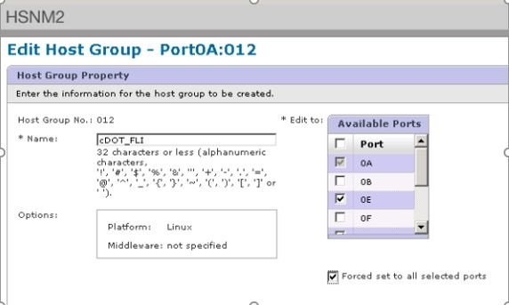

= Exemplo de migração de teste usando Hitachi AMS2100
:allow-uri-read: 
:icons: font
:imagesdir: ../media/

[role="lead"]
A seguir está um exemplo de migração de teste usando um Hitachi AMS2100 como matriz estrangeira. Dependendo dos arrays envolvidos, dos sistemas operacionais host e de outras variáveis, suas etapas podem ser diferentes.

Você pode usar o exemplo a seguir como um guia geral para as etapas necessárias para executar migrações de teste. A NetApp recomenda realizar migrações de teste o mais cedo possível para encontrar e ter o máximo de tempo possível para resolver quaisquer problemas trazidos à luz pelos testes. Uma migração de teste deve ser realizada em todas as combinações de arrays de origem e destino antes de prosseguir com as migrações de produção.

Para executar uma migração de teste, execute as seguintes etapas:

.Passos
. Crie um LUN de teste de 2 GB na matriz de origem.
. Inicie sessão no Hitachi Storage Navigator Modular como sistema.
. Selecione matriz AMS 2100.
. Clique em *Mostrar e Configurar matriz*.
. Faça login usando root.
. Expanda *Groups* e selecione *unidades lógicas*.
. Selecione *Create LU* para criar o LUN de teste.
. Crie um LUN de teste de 2 GB.
. Clique em *OK*.
. Ignore a atribuição de LUN aqui e continue clicando em *Fechar*.
. Verifique se o LUN 0026 foi criado.
. Expanda **groups**e selecione *unidades lógicas*.
. Selecione *Host Groups* para mapear o LUN de teste para o grupo host cDOT_FLI.
. Selecione o grupo de hosts cDOT_FLI criado na etapa anterior e clique em *Editar grupo de hosts*.
. Escolha as portas para o grupo de hosts. Neste exemplo, escolhemos 0a, 0e, 1a, 1e. Selecione a opção Forced Set to All Selected Ports (conjunto forçado para todas as portas selecionadas)
+

. Clique em *unidades lógicas* e adicione o LUN de teste LUN0026.
. Clique em *OK* para mapear o LUN.
. Selecione *Sim, li o aviso acima e quero editar o grupo de hosts* e clique em *confirmar*.
. Verifique a criação do grupo anfitrião e clique em *Fechar*.
. Verifique o LUN de teste e o mapeamento do armazenamento de origem para o armazenamento de destino e execute a importação FLI (Foreign LUN Import).
. Inicie sessão no armazenamento ONTAP através de SSH utilizando admin user.
. Altere o modo para Avançado. `DataMig-cmode::> set -privilege advanced`
. Digite y quando perguntado se deseja continuar com comandos avançados.
. Descubra a matriz de origem no ONTAP. Aguarde alguns minutos e tente detetar a matriz de origem.`storage array show`
+
.. Quando o storage array é descoberto pela primeira vez, o ONTAP pode não mostrar o array descobrindo automaticamente. Use as instruções a seguir para redefinir a porta do switch onde as portas do iniciador ONTAP estão conetadas.
+
Por exemplo, as portas 0a e 0b do iniciador de cluster DataMig-cmode ONTAP estão conetadas às portas Cisco 4/9 e 4/11. Para reiniciar a porta 4/9 no switch Cisco:

+
[listing]
----
conf t
interface fc4/9
shutdown
no shutdown
exit
exit
----
+
Repor uma porta é normalmente suficiente. Verifique a lista de array e os caminhos LUN após redefinir uma porta.

. Verifique se o array de origem é descoberto através de todas as portas do iniciador: `storage array config show -array-name HITACHI_DF600F_1`
+
[listing]
----

             LUN   LUN
Node         Group Count     Array Name       Array Target Port Initiator
------------ ----- ----- ---------------------------- -----------------------
DataMig-cmode-01 0     1    HITACHI_DF600F_1     50060e801046b960        0a
                                                 50060e801046b964        0b
                                                 50060e801046b968        0a
                                                 50060e801046b96c        0b
DataMig-cmode-02 0     1    HITACHI_DF600F_1     50060e801046b960        0a
                                                 50060e801046b964        0b
                                                 50060e801046b968        0a
                                                 50060e801046b96c        0b
----
. Liste o LUN de teste mapeado a partir do armazenamento Hitachi e verifique as propriedades e caminhos do disco: `storage disk show -array-name HITACHI_DF600F_1 -instance`
+
[listing]
----

                  Disk: HIT-1.1
        Container Type: unassigned
            Owner/Home: -  / -
               DR Home: -
    Stack ID/Shelf/Bay: -  / -  / -
                   LUN: 0
                 Array: HITACHI_DF600F_1
                Vendor: HITACHI
                 Model: DF600F
         Serial Number: 83017542001A
                   UID: 48495441:43484920:38333031:37353432:30303236:00000000:00000000:00000000:00000000:00000000
                   BPS: 512
         Physical Size: -
              Position: present
Checksum Compatibility: block
             Aggregate: -
                  Plex: -
Paths:
                                LUN  Initiator Side        Target Side                                                        Link
Controller         Initiator     ID  Switch Port           Switch Port           Acc Use  Target Port                TPGN    Speed      I/O KB/s          IOPS
------------------ ---------  -----  --------------------  --------------------  --- ---  -----------------------  ------  -------  ------------  ------------
DataMig-cmode-01   0a             0  DM-Cisco9506-1:4-9    DM-Cisco9506-1:2-24   AO  INU  50060e801046b968              2   2 Gb/S             0             0
DataMig-cmode-01   0b             0  DM-Cisco9506-2:4-9    DM-Cisco9506-2:2-24   AO  INU  50060e801046b96c              2   2 Gb/S             0             0
DataMig-cmode-01   0b             0  DM-Cisco9506-2:4-9    DM-Cisco9506-2:1-14   AO  INU  50060e801046b964              1   2 Gb/S             0             0
DataMig-cmode-01   0a             0  DM-Cisco9506-1:4-9    DM-Cisco9506-1:1-14   AO  INU  50060e801046b960              1   2 Gb/S             0             0
DataMig-cmode-02   0a             0  DM-Cisco9506-1:4-11   DM-Cisco9506-1:2-24   AO  INU  50060e801046b968              2   2 Gb/S             0             0
DataMig-cmode-02   0b             0  DM-Cisco9506-2:4-11   DM-Cisco9506-2:2-24   AO  INU  50060e801046b96c              2   2 Gb/S             0             0
DataMig-cmode-02   0b             0  DM-Cisco9506-2:4-11   DM-Cisco9506-2:1-14   AO  INU  50060e801046b964              1   2 Gb/S             0             0
DataMig-cmode-02   0a             0  DM-Cisco9506-1:4-11   DM-Cisco9506-1:1-14   AO  INU  50060e801046b960              1   2 Gb/S             0             0

Errors:
-

DataMig-cmode::*>
----
. Marque o LUN de origem como estranho usando o número de série: `storage disk set-foreign-lun { -serial-number 83017542001A } -is-foreign true`
. Verifique se o LUN de origem está marcado como estranho: `storage disk show -array-name HITACHI_DF600F_1`
. Liste todos os arrays estrangeiros e seus números de série: `storage disk show -container-type foreign -fields serial-number`
+
[NOTE]
====
O comando LUN create deteta o tamanho e o alinhamento com base no deslocamento da partição e cria o LUN de acordo com o argumento de disco estranho.

====
. Criar um volume de destino: `vol create -vserver datamig flivol aggr1 -size 10g`
. Crie um LUN de teste usando um LUN externo: `lun create -vserver datamig -path /vol/flivol/testlun1 -ostype linux -foreign-disk 83017542001A`
. Liste o LUN de teste e verifique o tamanho do LUN com o LUN de origem: `lun show`
+
[NOTE]
====
Para a migração off-line do FLI, o LUN deve estar on-line para mapeá-lo para um grupo e, em seguida, deve estar offline antes de criar o relacionamento de importação LUN.

====
. Crie um grupo de teste do protocolo FCP sem adicionar iniciadores: `lun igroup create -vserver datamig -igroup testig1 -protocol fcp -ostype linux`
. Mapeie o LUN de teste para o grupo de teste: `lun map -vserver datamig -path /vol/flivol/testlun1 -igroup testig1`
. Offline o LUN de teste: `lun offline -vserver datamig -path /vol/flivol/testlun1`
. Criar relação de importação com LUN de teste e LUN externo: `lun import create -vserver datamig -path /vol/flivol/testlun1 -foreign-disk 83017542001A`
. Inicie a migração (importação): `lun import start -vserver datamig -path /vol/flivol/testlun1`
. Monitorize o progresso da importação: `lun import show -vserver datamig -path /vol/flivol/testlun1`
. Verifique se o trabalho de importação foi concluído com êxito: `lun import show -vserver datamig -path /vol/flivol/testlun1`
+
[listing]
----
vserver foreign-disk   path                operation admin operational percent
                                         in progress state state       complete
-------------------------------------------------------------------------------
datamig 83017542001A   /vol/flivol/testlun1
                                           import    started
                                                           completed        100
----
. Inicie o trabalho de verificação para comparar LUNs de origem e destino. Monitorize o progresso da verificação: `lun import verify start -vserver datamig -path /vol/flivol/testlun1`
+
[listing]
----
DataMig-cmode::*> lun import show -vserver datamig -path /vol/flivol/testlun1
vserver foreign-disk   path                operation admin operational percent
                                         in progress state state       complete
-------------------------------------------------------------------------------
datamig 83017542001A   /vol/flivol/testlun1
                                           verify    started
                                                           in_progress       44
----
. Verifique se o trabalho de verificação está concluído sem erros: `lun import show -vserver datamig -path /vol/flivol/testlun1`
+
[listing]
----
vserver foreign-disk   path                operation admin operational percent
                                         in progress state state       complete
-------------------------------------------------------------------------------
datamig 83017542001A   /vol/flivol/testlun1
                                           verify    started
                                                           completed        100
----
. Exclua a relação de importação para remover o trabalho de migração: `lun import delete -vserver datamig -path /vol/flivol/testlun1``lun import show -vserver datamig -path /vol/flivol/testlun1`
. Desmapeie o LUN de teste do grupo de teste: `lun unmap -vserver datamig -path /vol/flivol/testlun1 -igroup testig1`
. Online o LUN de teste: `lun online -vserver datamig -path /vol/flivol/testlun1`
. Marque o atributo LUN estrangeiro como false: `storage disk modify { -serial-number 83017542001A } -is-foreign false`
+
[NOTE]
====
Não remova o grupo de hosts criado no storage de origem com as portas do iniciador ONTAP. O mesmo grupo de hosts é reutilizado durante as migrações a partir desse array de origem.

====
. Remova o LUN de teste do armazenamento de origem.
+
.. Inicie sessão no Hitachi Storage Navigator Modular como um sistema.
.. Selecione matriz AMS 2100 e clique em *Mostrar e Configurar matriz*.
.. Faça login usando root.
.. Selecione *Groups* e, em seguida, selecione *Host Groups*.
.. Selecione _cDOT_FLI Igroup_ e clique em *Edit Host Group*.
.. Na janela *Edit Host Group*, selecione todas as portas de destino escolhidas para mapear o LUN de teste e selecione *Forced Set to All Selected Ports*.
.. Selecione o separador *unidades lógicas*.
.. Selecione o LUN de teste na janela *Assigned Logical Units* (unidades lógicas atribuídas).
.. Selecione *Remover* para remover o mapeamento LUN.
.. Clique em OK.
.. Não remova o grupo anfitrião e continue a eliminar o LUN de teste.
.. Selecione unidades lógicas.
.. Selecione o LUN de teste criado na etapa anterior (LUN0026).
.. Clique em *Delete LUN*.
.. Clique em *Confirm* para excluir o LUN de teste.

. Elimine o LUN de teste no armazenamento de destino.
+
.. Inicie sessão no armazenamento ONTAP através de SSH utilizando admin user.
.. Offline o LUN de teste no sistema de armazenamento NetApp: `lun offline -vserver datamig -path /vol/flivol/testlun1`
+
[NOTE]
====
Certifique-se de que não seleciona outro LUN de host.

====
.. Destrua o LUN de teste no sistema de armazenamento NetApp: `lun destroy -vserver datamig -path /vol/flivol/testlun1`
.. Offline o volume de teste no sistema de armazenamento NetApp: `vol offline -vserver datamig -volume flivol`
.. Destrua o volume de teste no sistema de armazenamento NetApp: `vol destroy -vserver datamig -volume flivol`

